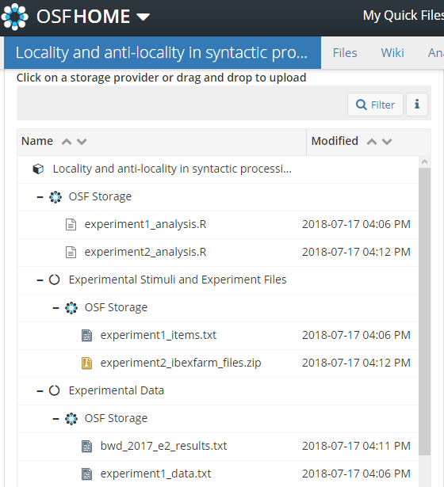

[//]: # (TO DO: reproducibility/registration blurbs, fix links)

## Structuring projects

!!! important "What to include in a project"
    When you upload a project to the OSF, do your best to include everything that someone would need to reproduce the study. This includes stimuli and other materials, a description of your methods, experiment scripts, analysis scripts. You should also include a summary of the project.

Projects on the OSF are modular. Instead of projects being connected like an umbrella or ladder, with smaller projects underneath some top level, on the OSF projects are islands that you construct one-way bridges between. You can define as many components as you like, how you like, and you have the same options for a component as you do the whole project. You can create wiki pages, set usage rights, permissions, citation identifiers, and upload files locally for each component in your project. So you can make everything public except for a few components, make everything private except for the overarching project, or anything in between. 

[//]: # (reminder, link to public [example])

### Storage 

You may store files on the OSF itself or connect your project with another host. There's no limit on OSF storage per project or per user except that individual files must be 5 GB or less. If you need to upload a file larger than that, you have to use an add-on. 

#### Add-ons

You can connect GitHub, Dropbox, Google Drive, and other storage hosts to your project (see the complete list and accompanying instructions [here](http://help.osf.io/m/addons/c/245203)). Typically, you can only connect one repo/folder/account per component.

### Citations

...

[//]: # (do people use mendeley/zotero/etc)

## Sharing and collaborating

### Sharing 

You can give out view-only links (Contributors > View-only Links) to your project or to a specific component if you'd like to share what you have before you make it public. This is useful if you're sharing with someone who doesn't have an OSF account, or who only needs to look over it once or twice. Another option is to add a contributor with read-only access, and mark them as a non-bibliographic contributor.

### Collaborating

You'll need to be a contributor to do anything, including viewing it at all, if the project is still private. If your prospective contributor tries going to the homepage of your project before you've added them, they'll be asked to request access from you.

#### Adding contributors

 To add a contributor, navigate to the top level of the project > Contributors > Add. You'll have to add them by searching for their name, so you should check their profile for details to identify them (which is why it's good to fill out the profile/change your display picture to something recognizable). 

##### Adding non-OSF contributors

If, for example, you want to add a contributor for the sake of bibliographic credit, you can add contributors even if they don't have an OSF account. After entering their name, you'll see an option to add them as an unregistered contributor, with the option to send them an email to notify them (at which point they can create an account if they want). 

##### Permissions for contributors

There are three levels of permissions you can give a contributor: administrator; read/write; read only. You can also decide whether a contributor is listed on the project and its citations by checking the "Bibliographic Contributor" box. 

## Reproducibility

[//]: # (ask Chris and Caroline about these)
...

### Registration

...

